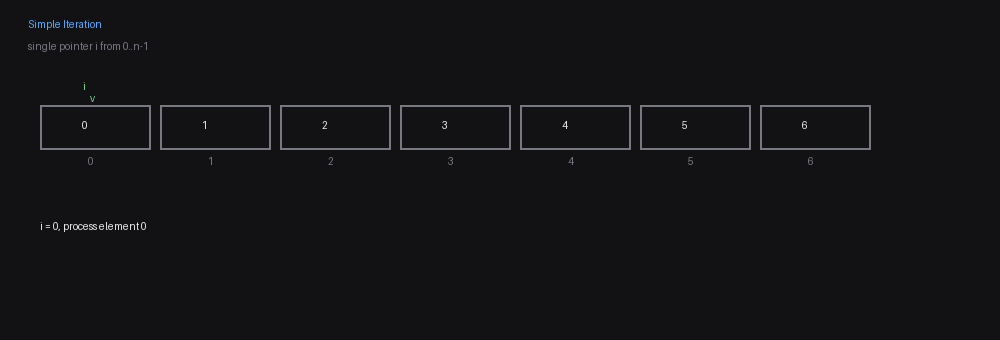
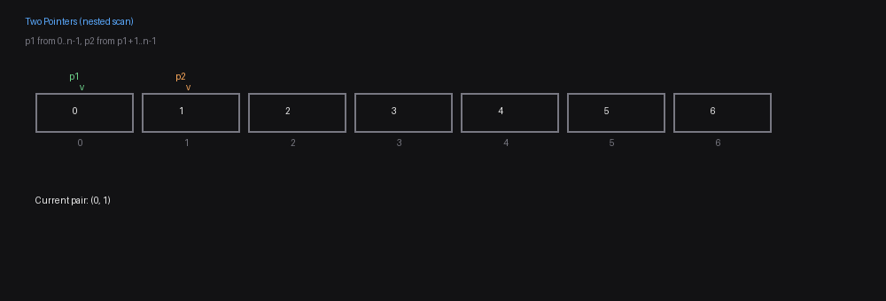
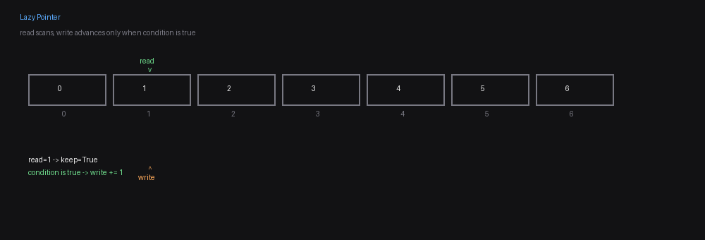
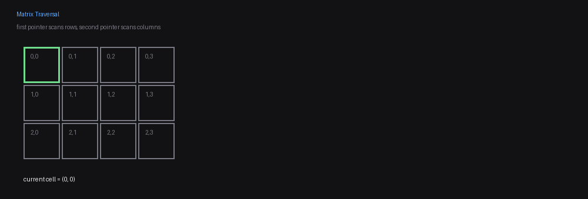
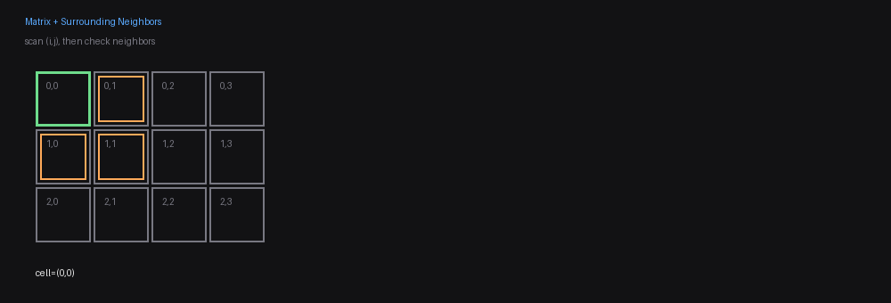

# Arrays Patterns & Templates

This page is a practical guide for the most reusable Array-related patterns.

## Solved Array Questions (ordered 1 → n)

<!-- ARRAY_QUESTIONS_START -->
This block is auto-updated by `scripts/update_leetcode_stats.py`.

- Profile: [leetcode.com/devcesarlopes](https://leetcode.com/devcesarlopes)
- Updated at: 2026-04-13 23:08 UTC
- Source: recent accepted submissions filtered by the `array` tag

| # | LeetCode ID | Problem |
| ---: | ---: | --- |
| 1 | 54 | [Spiral Matrix](https://leetcode.com/problems/spiral-matrix/) |
| 2 | 228 | [Summary Ranges](https://leetcode.com/problems/summary-ranges/) |
| 3 | 283 | [Move Zeroes](https://leetcode.com/problems/move-zeroes/) |
| 4 | 303 | [Range Sum Query - Immutable](https://leetcode.com/problems/range-sum-query-immutable/) |
| 5 | 485 | [Max Consecutive Ones](https://leetcode.com/problems/max-consecutive-ones/) |
| 6 | 495 | [Teemo Attacking](https://leetcode.com/problems/teemo-attacking/) |
| 7 | 566 | [Reshape the Matrix](https://leetcode.com/problems/reshape-the-matrix/) |
| 8 | 598 | [Range Addition II](https://leetcode.com/problems/range-addition-ii/) |
<!-- ARRAY_QUESTIONS_END -->

## Iteration Templates

### Pattern: Simple Iteration

- Single pointer from `0` to `n-1`.

```python
for i in range(0, n):
	# Do actions stack based on condition
```



### Pattern: Two Pointers (nested scan)

- First pointer `p1` moves from `0` to `n-1`.
- Second pointer `p2` moves from `p1 + 1` to `n-1`.

```python
for p1 in range(0, n):
	for p2 in range(p1 + 1, n):
		# compare/use nums[p1], nums[p2]
```



---

### Pattern: Lazy pointer

- One pointer scans from left to right.
- One write pointer marks the next valid position.

```python
write = 1
for read in range(1, n):
	if condition:
		write += 1
```



---

### Pattern: Matrix traversal

- Matrix scan (`m x n`):

```python
for i in range(0, m):
	for j in range(0, n):
		# process cell (i, j)
```



### Pattern: Matrix traversal + surrounding elements check

- Matrix scan (`m x n`):
- Surrounding-neighbors scan (for each cell):

```python
for i in range(0, m):
	for j in range(0, n):

        for di in [-1, 0, 1]:
            for dj in [-1, 0, 1]:
                ni, nj = i + di, j + dj
                if 0 <= ni < m and 0 <= nj < n:
                    # valid neighbor
```



## 3) Question Templates

### Pattern: Two Pointers (nested scan)

**Sample question:** [1. Two Sum](https://leetcode.com/problems/two-sum/)

**Why this pattern fits:**

- You must compare one element with the elements that come after it.
- The brute-force version is naturally a nested scan over pairs of indices.
- This makes the two-pointer nested iteration pattern the most direct way to describe the search space.

**Why not another pattern:**

- A simple single iteration is not enough, because one index alone cannot test all pairs.

```python
class Solution:
	def twoSum(self, nums: List[int], target: int) -> List[int]:
		for i in range(0, len(nums)):
			for j in range(i + 1, len(nums)):
				if nums[i] + nums[j] == target:
					return [i, j]
```

### Pattern: Stack

**Sample question:** [20. Valid Parentheses](https://leetcode.com/problems/valid-parentheses/)

**Why this pattern fits:**

- The problem depends on the most recent unmatched opening bracket.
- That is exactly last-in, first-out behavior, which is what a stack gives you.
- Every closing bracket must match the latest valid opening bracket still waiting to be closed.

**Why not another pattern:**

- A two-pointers scan would miss the nested structure of parentheses.
- A lazy pointer is for in-place writing, not for matching open/close state.
- A counting dictionary is not enough, because order matters, not just frequency.

```python
class Solution:
	def isValid(self, s: str) -> bool:
		stack = deque()
		opens = ['(', '{', '[']
		close_match = {'(': ')', '{': '}', '[': ']'}
		for i in range(len(s)):
			if s[i] in opens:
				stack.append(s[i])
			else:
				if len(stack) == 0:
					return False
				open = stack.pop()
				if close_match[open] != s[i]:
					return False
		return len(stack) == 0
```

### Pattern: In-place Swap / In-place Write Pointer

**Sample question:** [26. Remove Duplicates from Sorted Array](https://leetcode.com/problems/remove-duplicates-from-sorted-array/)

**Why this pattern fits:**

- The array is sorted, so duplicates are grouped together.
- You only need to keep the next valid unique value and place it at the next write position.
- The problem explicitly requires the answer to be done in-place, so using a lazy pointer is a natural fit.
- One pointer scans all values, and the write position only moves when the current value should remain in the compacted array.

**Why not another pattern:**

- A simple iteration alone can detect duplicates, but it does not solve the in-place rewrite requirement.
- A stack adds unnecessary extra memory.
- A hash table or a separate result array would make the problem easier, but they use extra space.
- Since this question requires an in-place solution, the lazy pointer pattern is the right tradeoff.

```python
class Solution:
	def removeDuplicates(self, nums: List[int]) -> int:
		k = 1
		for i in range(1, len(nums)):
			if nums[i] != nums[k - 1]:
				nums[i], nums[k] = nums[k], nums[i]
				k += 1
		return k
```

### Pattern: XOR to remove paired elements

**Sample question:** [136. Single Number](https://leetcode.com/problems/single-number/)

**Why this pattern fits:**

- Every duplicated number cancels itself with XOR.
- After processing the whole array, only the unpaired number remains.
- This gives a very compact linear solution with constant extra space.

**Why not another pattern:**

- A hash table can also solve it, but it uses extra memory.

**Example math:**

Input: `nums = [4, 1, 2, 1, 2]`

We can group equal values because XOR is associative and duplicated values cancel out:

$$
	ext{result} = 0 \oplus 4 \oplus 1 \oplus 2 \oplus 1 \oplus 2
$$

$$
	ext{result} = 0 \oplus (1 \oplus 1) \oplus (2 \oplus 2) \oplus 4
$$

$$
	ext{result} = 0 \oplus 0 \oplus 0 \oplus 4
$$

$$
	ext{result} = 4
$$

So the final answer is:

$$
4
$$

The reason this works is:

$$
a \oplus a = 0
$$

and

$$
a \oplus 0 = a
$$

So the paired values cancel each other, and only the unpaired value remains.

```python
class Solution:
	def singleNumber(self, nums: List[int]) -> int:
		x = 0
		for i in range(0, len(nums)):
			x = x ^ nums[i]
		return x
```

### Pattern: Hash Table (dict) counting

**Sample question:** [387. First Unique Character in a String](https://leetcode.com/problems/first-unique-character-in-a-string/)

**Why this pattern fits:**

- The problem asks for uniqueness, which depends on frequency.
- A dictionary lets you count each character first and then scan again to find the first one with count `1`.
- The pattern is naturally a two-pass frequency-count solution.

**Why not another pattern:**

- A stack does not help because there is no nested or last-in, first-out behavior.
- Two pointers do not help because uniqueness is global, not based on comparing nearby elements.
- XOR is not suitable because characters may appear more than twice and order still matters for the answer.

```python
class Solution:
	def firstUniqChar(self, s: str) -> int:
		table = {}
		for i, c in enumerate(s):
			if c not in table.keys():
				table[c] = 1
			else:
				table[c] += 1
		for i, c in enumerate(s):
			if table[c] == 1:
				return i
		return -1
```

### Pattern: Matrix traversal + surrounding elements check

**Sample question:** [661. Image Smoother](https://leetcode.com/problems/image-smoother/)

**Why this pattern fits:**

- You must visit every cell in the matrix.
- For each cell, you must inspect the surrounding cells that are inside the grid bounds.
- So this is not only matrix traversal, but matrix traversal plus neighbor validation.

**Why not another pattern:**

- A simple one-dimensional iteration does not describe the row/column structure.
- Two pointers are not the right abstraction because the work is based on coordinates, not pair comparisons.
- A lazy pointer is unrelated because the task is about local averaging, not in-place filtering.

```python
class Solution:
	def imageSmoother(self, img: List[List[int]]) -> List[List[int]]:
		result = [[0] * len(img[0]) for _ in range(len(img))]

		for i in range(0, len(img)):
			for j in range(0, len(img[i])):
				sum = 0
				c = 0
				for di in [-1, 0, 1]:
					for dj in [-1, 0, 1]:
						ni, nj = i + di, j + dj
						if 0 <= ni < len(img) and 0 <= nj < len(img[0]):
							sum += img[ni][nj]
							c += 1
				result[i][j] = sum // c
		return result
```

### Pattern: Iterate over unrepeated indices

**Sample question:** [2094. Finding 3-Digit Even Numbers](https://leetcode.com/problems/finding-3-digit-even-numbers/)

**Why this pattern fits:**

- You are building numbers by choosing multiple positions from the same array.
- The key constraint is that the same index cannot be reused in the same candidate number.
- So the main pattern is controlled enumeration over distinct indices.

**Why not another pattern:**

- A simple iteration cannot explore all 3-digit combinations.
- A standard two-pointers pattern only covers pairs, not three distinct chosen positions.
- A hash table is not the main idea here, because the hard part is generating valid index combinations.

```python
class Solution:
	def findEvenNumbers(self, digits: List[int]) -> List[int]:
		l = len(digits)
		nums = set()
		for i in range(0, l):
			for j in range(0, l):
				if i == j:
					continue
				for k in range(0, l):
					if j == k or i == k:
						continue
					n = 100 * digits[i] + 10 * digits[j] + digits[k]
					if n >= 100 and n % 2 == 0:
						nums.add(n)

		return sorted(list(nums))
```
