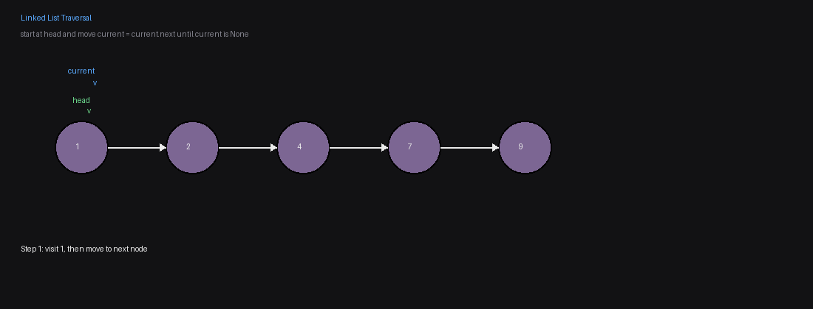
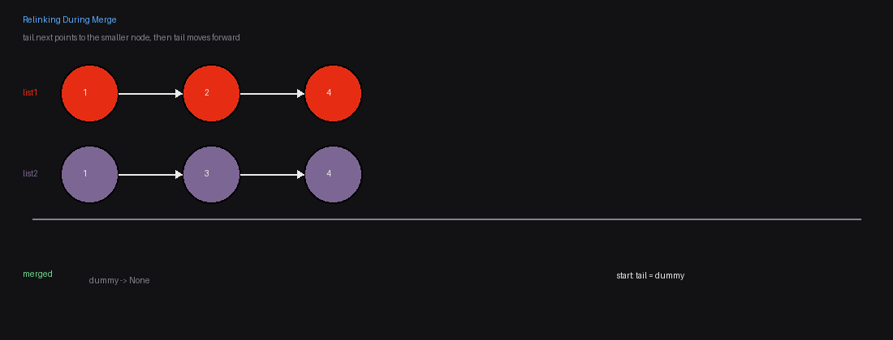
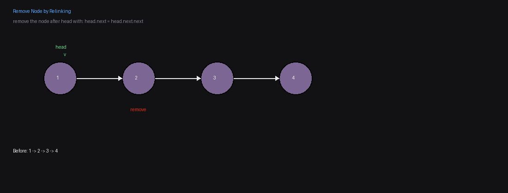
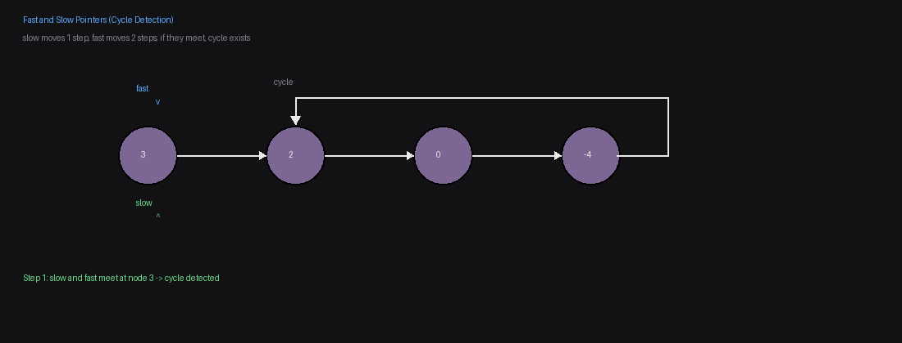

# Linked List Patterns & Templates

This page is a practical guide for reusable Linked List patterns.

## Iteration Templates

### 1) Pattern: Traverse from beginning to end

- Start with a pointer at the head.
- Visit the current node.
- Move forward with `current = current.next`.
- Stop when `current` becomes `None`.

```python
current = head
while current:
	# process current.val
	current = current.next
```



---

### 2) Pattern: Relink nodes while merging two sorted lists

- Keep a `dummy` node and a `tail` pointer.
- Compare the two current nodes (`list1.val` vs `list2.val`).
- Point `tail.next` to the smaller node.
- Advance the chosen list and then move `tail`.
- When one list ends, attach the remaining nodes from the other list.

```python
dummy = ListNode()
tail = dummy

while list1 and list2:
	if list1.val < list2.val:
		tail.next = list1
		list1 = list1.next
	else:
		tail.next = list2
		list2 = list2.next
	tail = tail.next

if list1:
	tail.next = list1
elif list2:
	tail.next = list2

return dummy.next
```



---

### 3) Pattern: Remove an element by relinking pointers

- If you want to remove the node after `head`, you can relink directly:

```python
head.next = head.next.next
```

- This skips one node in the chain.
- Use this only when `head` and `head.next` exist.



## Question Templates

### Pattern: Merge with relinking + tail pointer

**Sample question:** [21. Merge Two Sorted Lists](https://leetcode.com/problems/merge-two-sorted-lists/)

**Why this pattern fits:**

- The two inputs are already sorted, so each step only needs to choose the smaller front node.
- A `tail` pointer lets you build the final list in order without creating new nodes.
- This follows the problem statement directly: splice together existing nodes.

**Why not another pattern:**

- Converting lists to arrays and sorting again would add unnecessary work.
- Recursion can also solve it, but iterative relinking is straightforward and avoids recursion depth concerns.

```python
# Definition for singly-linked list.
# class ListNode:
#     def __init__(self, val=0, next=None):
#         self.val = val
#         self.next = next
class Solution:
	def mergeTwoLists(self, list1: Optional[ListNode], list2: Optional[ListNode]) -> Optional[ListNode]:
		dummy = ListNode()
		tail = dummy

		while list1 and list2:
			if list1.val < list2.val:
				tail.next = list1
				list1 = list1.next
			else:
				tail.next = list2
				list2 = list2.next
			tail = tail.next

		if list1:
			tail.next = list1
		elif list2:
			tail.next = list2

		return dummy.next
```

### Pattern: Fast and Slow pointers to find cycles

**Sample question:** [141. Linked List Cycle](https://leetcode.com/problems/linked-list-cycle/)

**Why this pattern fits:**

- The `slow` pointer moves one node at a time.
- The `fast` pointer moves two nodes at a time.
- If there is a cycle, both pointers will eventually meet.
- If `fast` reaches `None`, there is no cycle.

```python
class Solution:
	def hasCycle(self, head: Optional[ListNode]) -> bool:
		dummy = ListNode()
		dummy.next = head
		slow = fast = head

		while fast and fast.next:
			fast = fast.next.next
			slow = slow.next

			if slow == fast:
				return True

		return False
```


